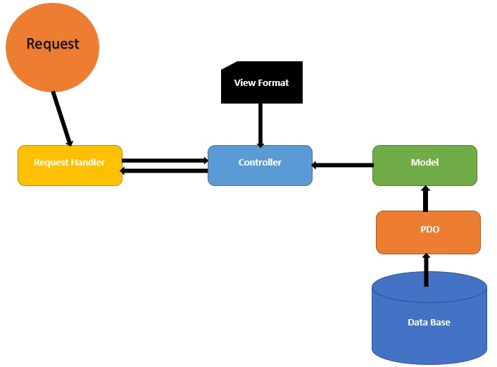

# CreateRESTfulAPIs

This app creates RESTful service apis to list, show, edit & delete items and uses GET, POST, PUT & DELETE verbs. Used MVC architecture

# Built
App is built on core PHP 7.2.5 and MySQL 5.6

# Architecture

# URI structure
URI structure http://[host]:[port]/api/{service name}]/v{version number}/{resource}

An example: http://127.0.0.1:8080/api/itemstore/v1/items

# CRUD actions

