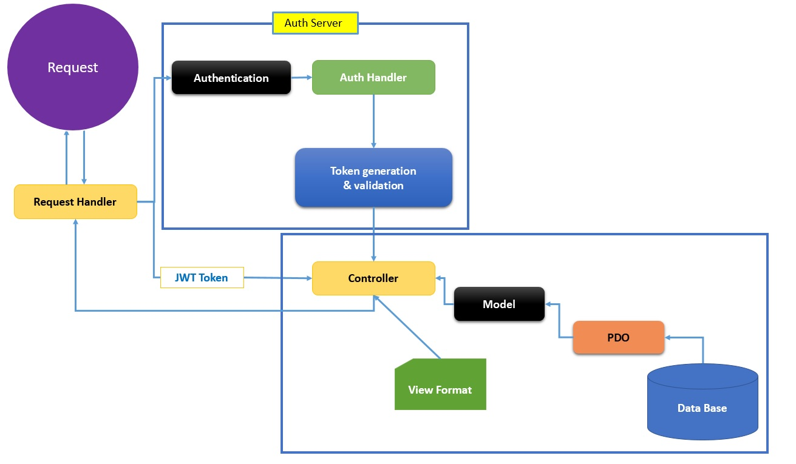

# CreateRESTfulAPIs

App creates RESTful service apis to create, show, list, edit & delete item. It uses GET, POST, PUT, PATCH & DELETE verbs to perform actions. The API returns status 1 for a successful request along with additional data and status 0 for an unsuccessful request which is an error.

# Built
App is built on core PHP 7.2.5 and MySQL 5.6

# CRUD actions

# Instructions 
* Do not use:
 
 /api/itemstore/v1/getallitems 
 
 /api/itemstore/v1/createitem
 
 /api/itemstore/v1/deleteitem
 
 * A trailing forward slash (/) should not be included in URIs

Exapmle: /api/itemstore/v1/items/       

# V2 [version 2]

Program to interfaces, not implementations

# Object Container Interface

Implemented PSR-11

# URI structure

URI structure http://[host]:[port]/api/{service name}]/v{version number}/{resource}/{resource ID}

1. Login URI: http://127.0.0.1:8080/api/itemstore/v2/auth/login
2. Logout URI: http://127.0.0.1:8080/api/itemstore/v2/auth/logout

3. Items URI: http://127.0.0.1:8080/api/itemstore/v2/items/1 (requires JWT token on header)
4. Users URI: http://127.0.0.1:8080/api/itemstore/v2/users/1 (requires JWT token on header)

# Features

- [x] MVC Architecture
- [x] Program to interfaces
- [x] Object container - PSR-11
- [X] CORS Compatible
- [X] S.O.L.I.D. Disign
- [X] Traits
- [X] JWT Authentication
- [ ] Shorting & Filtering
- [ ] Pagination

# Architecture

# Policy

